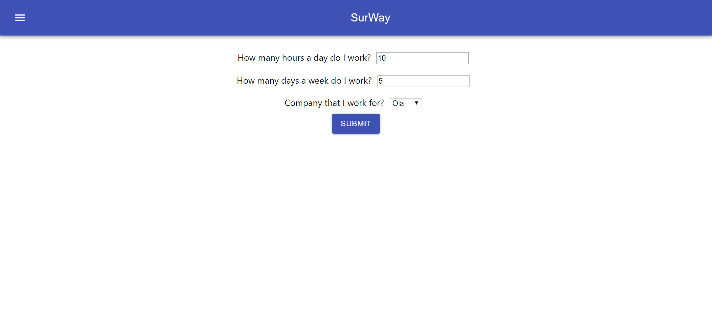

# [SurWay](sur-way.herokuapp.com)

#### [View Live Version!](sur-way.herokuapp.com) - sur-way.herokuapp.com

SurWay is a survey/polling website for cab drivers where they can report their typical work hours and which company they work for, this data is then stored anonymously and used to generate charts and insights.

* Frontend - [React](https://reactjs.org/), [Material-UI](https://material-ui.com/), [React ChartsJS 2](https://www.npmjs.com/package/react-chartjs-2)
* Backend - [NodeJS Express](https://expressjs.com/)
* Database - [MongoDB](https://www.mongodb.com/)
* Hosting - [Heroku](https://www.heroku.com/) - Free Tier
* Local Development - [Docker](https://www.docker.com/) and [Docker Compose](https://docs.docker.com/compose/)

> Below is an excerpt from the Blog I wrote about the Making of SurWay, you can find the original post [here](https://www.linkedin.com/pulse/surway-survey-site-drivers-my-first-react-app-rohan-sawant/)

#### SurWay

I completed work on my first React App a few days ago, the App is called SurWay.

This is a survey website for cab drivers where they can report their typical work hours and which company they work for, this data is then stored anonymously and used to generate charts and insights.

> This took way longer than expected to complete. The general idea was to add several features like browser finger printing and SSO to ensure that a single user could be allowed to cast a vote only once. But, I decided to postpone these features for a future release. 

I had been trying to make up time to learn JavaScript, specifically Node and React for the better part of the last year. I have gone through several learn in 4-hour courses and a million tutorials but, as always actually making a project with JS was something which helped me learn things even better. I even wrote about it here in - [The 'I think I have got the hang of it' Moment - React](https://dev.to/rohansawant/the-i-think-i-have-got-the-hang-of-it-moment-react-5025)

This is a general overview of how I went about building it, with some useful resources and some screenshots. 

#### Step 1 - Set up Node and React

I used create-react-app and some other starter templates to create a boilerplate, then I used Docker and Docker-Compose to quickly spin up a local MongoDB instance for me to work on.

#### Step 2 - Node, React, Mongo - Making them all talk to each other.

I first got a basic submit form working 

Then I created the DB Schema in Node, added the required routes in [Express](https://expressjs.com/), tested them with [PostMan](https://www.getpostman.com/), I configured the frontend with React to ensure forms were submitted successfully.

If you want an in-depth tutorial about how I went about doing that follow this - [Let’s build a full stack MongoDB, React, Node and Express (MERN) app](https://medium.com/javascript-in-plain-english/full-stack-mongodb-react-node-js-express-js-in-one-simple-app-6cc8ed6de274)

#### Step 3 - Displaying the into Charts.

After digging around for a way to implement charts in React I stumbled across [react-chartjs-2](https://www.npmjs.com/package/react-chartjs-2). I retrieved the data from my MongoDB using Express and Node and displayed the charts in React.  

#### Step 4 - Making it pretty!

I decided to use [material-ui](https://material-ui.com/) to make designing things easier. After digging around for a color pallet I found [this ](https://material-ui.com/system/palette/)right under my nose.  

My App now started to look like this. 

_Form Page_

_Results Page

### [View Live Version!](sur-way.herokuapp.com) 

#### Bonus!

I built this app on one of my trips out of the city. 

Here’s a special _learning-coding-in-car-gif_ for you!

